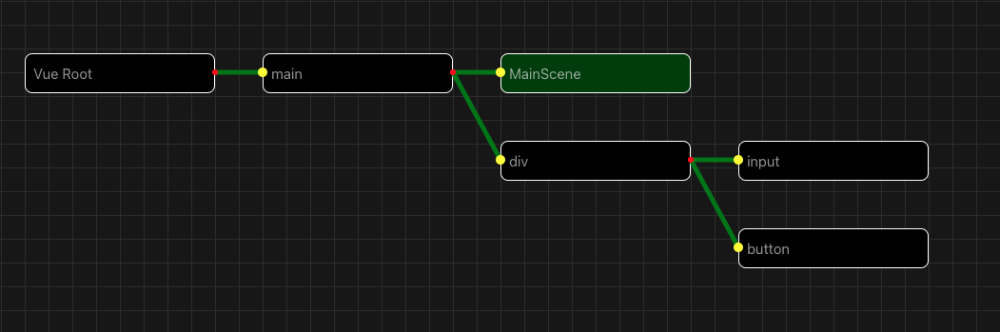
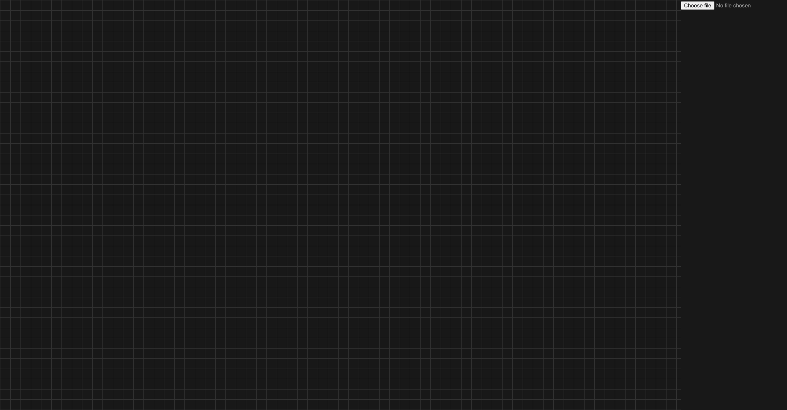
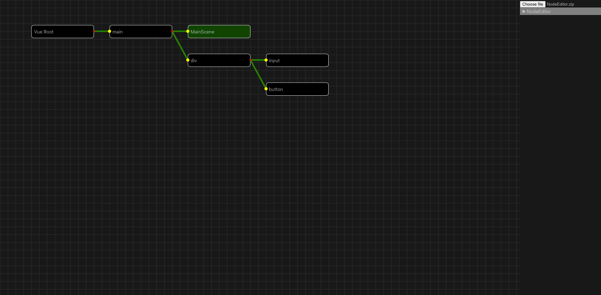

# Node editor
Originally intended as an over engineer Vue composition api implementation for fun. Now its a WIP vue analyses tool. Eventually, hopefully, a editor tool for Vue abstractions.

## Setup

Standard procedure:
- Clone the repo
- change directory into the repo
- run `npm i`
- run `npm run dev`

## Usage
> Once its started up you should be seeing this:

> Navigate to the url displayed, this should show the main view:

> Select a zip file containing a vue project repo using the `File select` in the top right of the screen an it should display the breakdown for the `App.vue`

