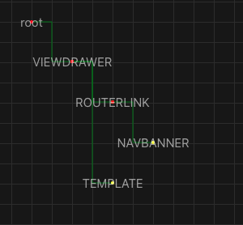

# Node editor
Originally intended as an over engineer Vue composition api implementation for fun. Now its a WIP node renderer. Eventually, hopefully, a editor tool for Vue abstractions.

## What it does
It has a file input that will only work with a `.vue` file.
On selecting a file, it should render a graph of the components template.

Holding space will enable click drag